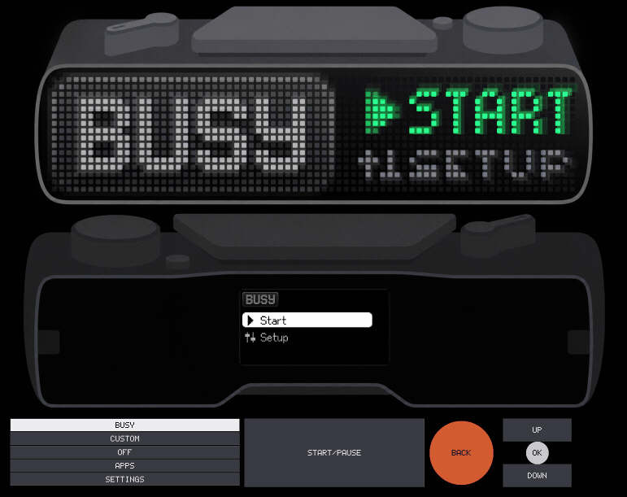
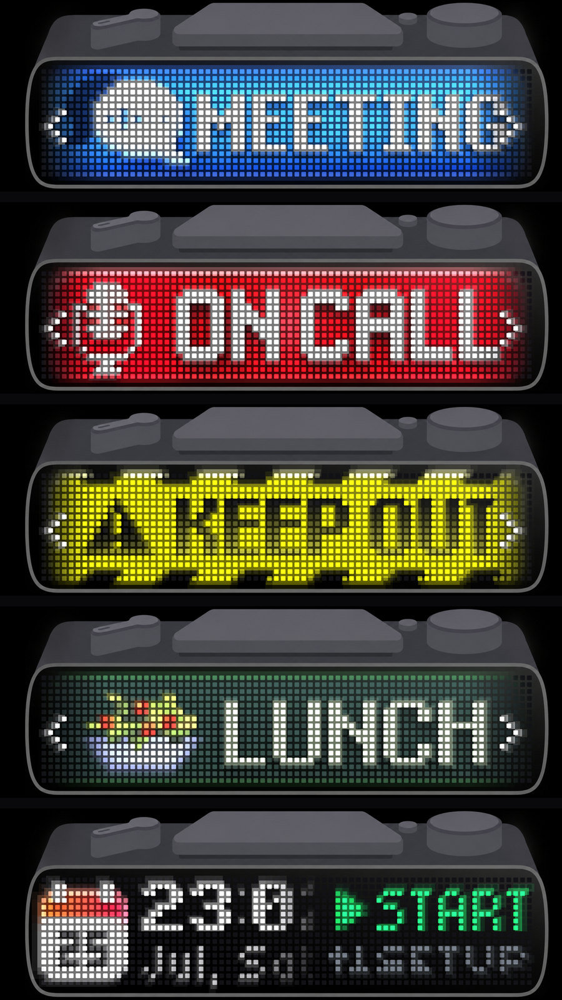
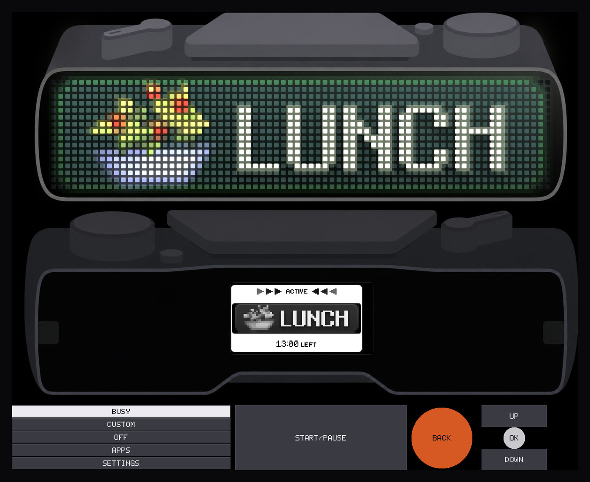

# BUSY Bar UI simulator

Runs the firmware's GUI stack and real applications on macOS/Linux against an
SDL window, so a UI change can be looked at before it is flashed.

<p align="center">
  
</p>

Both displays are drawn where they sit on the hardware, on renders of the
device. The front panel is a grid of 72x16 discrete LEDs, not a screen, and is
drawn as one — unlit dots and all — so what you see is close to what the
hardware does with the same framebuffer.

<p align="center">
  
</p>

Every image in this file is an unretouched capture and the recording above an
unretouched walkthrough, both taken with `tools/simctl.py` (see
[Walking the UI](#walking-the-ui-toolssimctlpy) and
[Recording](#recording-simctlpy-record)).

What is real: LVGL and its software renderer, `lib/lvgl_addons` (themes and
fonts), the whole of `applications/services/gui` (the `Widget` class and every
module), `font_registry`, `anim_file`, `setting_provider`, furi, and FreeRTOS
itself via its POSIX port. The displays are the real 72x16 RGB888 front panel
and 160x80 L8 back panel, at real resolution, showing real converted assets.

Every GUI application in the firmware runs, the Busy app included, driven by
the real scene managers and the real busy timer, and started by the real
`loader` when the real `desktop` sees the mode selector move. Sounds come out
of the workstation's speakers. The device's HTTP API is served too — the
firmware's own `web_server` service, on the workstation's sockets, including
the protobuf state stream on `/api/status/ws` — so `busylib` and anything else
that speaks to a Busy Bar can be pointed at the simulator. Network discovery is
available explicitly with `--network` or `--mdns`.

What is faked: the two display drivers push pixels into an SDL texture instead
of SPI, an on-screen control deck and the keyboard stand in for the buttons,
storage is an immutable generated tree plus a writable workstation overlay, and
the RTC starts from the workstation clock. Brightness and timezone settings use
the firmware's real services and persist in that overlay. Everything needing a
radio or a remote server — Wi-Fi, BLE, Matter, MQTT, OTA — remains an inert
stand-in. See `shim/` and `src/`, and "What the apps are talking to" below for
which is which.

## Build and run

Requires SDL2, CMake and `uv`; Ninja is preferred. Linux also needs the
DNS-SD/Avahi compatibility development package. ffmpeg is optional: the build
uses it to convert sounds, and
[recording](#recording-simctlpy-record) uses it to make a GIF.

```sh
simulator/tools/simctl.py doctor
simulator/tools/simctl.py build --test
./simulator/build/busybar-sim --scene clock
```

The equivalent manual build is:

```sh
cmake -S simulator -B simulator/build -G Ninja
cmake --build simulator/build
ctest --test-dir simulator/build --output-on-failure
```

Generated sources, app manifests, protobufs, backgrounds and runtime assets are
tracked build dependencies. A plain `cmake --build simulator/build` notices
changes under `assets/` and application `resources/`; no manual reconfigure is
needed. Git metadata is refreshed on every build when `git` is available and
falls back to `unknown` for source archives and minimal build containers.

To check a change by looking at it instead of by hand, see
[Walking the UI](#walking-the-ui-toolssimctlpy) — `tools/simctl.py` starts a
simulator, presses buttons and captures the panels.

The submodules the simulator needs are `lib/lvgl`, `lib/cjson`, `lib/mongoose`,
`lib/nanopb`, `assets/proto`, `lib/stb/stb_repo`, `fbt_layers/core_libs` and
`fbt_layers/freertos` (the last two recursively). CMake names the missing one
if any of them is empty.

The CTest smoke regression is headless and end to end: it boots applications,
waits on rendered-frame revisions, exercises the real HTTP API, checks all five
PNG dimensions at a large window scale, verifies capture does not consume the
furi heap, uploads an asset into pristine state, checks immutable-storage
containment, injects a signed low-battery state, and restarts against the same
overlay to prove brightness and timezone persistence.
`.github/workflows/simulator.yml` runs that path on macOS and Ubuntu.

Options:

| Flag | Meaning |
| --- | --- |
| `--scene NAME` | app to boot into, or `demo` for the widget demo; by default the mode selector decides |
| `-s, --scale N` | pixels per front LED; the default fills the screen, and the window is resizable |
| `--frames N` | present exactly N rendered frames after startup, then exit |
| `--keys LIST` | replay buttons before exiting, e.g. `up,ok` |
| `--screenshot DIR` | where the five coherent panel/window captures go: on exit with `--frames`, and whenever F12 or SIGUSR2 arrives |
| `--list-apps` | print every app that can be given to `--scene` |
| `--api-port N` | serve the device HTTP API on N, default 8042; `0` disables |
| `--listen ADDR` | bind the API to this address; default `127.0.0.1` |
| `--network` | bind to all IPv4 interfaces and enable mDNS |
| `--mdns` / `--no-mdns` | enable/disable discovery; disabled by default |
| `--state-dir DIR` | writable state overlay; default is a fresh temporary directory |
| `--headless` | use SDL's software-only dummy video driver |
| `--control PATH` | serve the tools' deterministic control socket |
| `-v, --verbose` | furi logging at trace level |

With no `--scene`, the simulator boots the way the device does: the startup app
runs, the mode selector settles on BUSY, and the Busy app starts. `--scene`
picks a different app to land on without pinning it there — moving the lever
still switches away, which is what the desktop service does for any app started
from somewhere other than the selector.

`BUSYBAR_SIM_ASSETS` overrides the immutable asset root; it defaults to the
tree CMake builds under `build/assets_root`, which mirrors the device layout so
`/ext/apps_assets/shared/fonts/...` and `/ext/apps_assets/clock/images/...`
both resolve. `BUSYBAR_SIM_STATE` supplies a persistent writable overlay, and
`--state-dir` takes precedence. Without either, each run gets isolated
temporary state. The simulator creates the writable `/ext` mount point before
firmware services start; asset uploads and storage writes never require
pre-creating workstation directories.

The tree carries two kinds of file. Most are build products — fonts, `.image`,
`.anim`, `.snd` — converted from `assets/` by `tools/gen_runtime_assets.py`.
The rest ship as they are, and live in an app's own `resources` directory,
which mirrors `/ext` below itself: the Busy app's themes are
`applications/main/busy/resources/apps_assets/busy/themes/<name>/theme.json`,
and each `theme.json` points at a background animation the converters produce.
Both halves have to be there or the theme picker offers only `BUSY`.
Rebuilding also removes mutable `data`, `user_assets`, `apps_data` and update
state left inside `assets_root` by simulator versions from before the writable
overlay; generated base assets remain immutable.

## Controls

The strip along the bottom of the window is a stand-in for the device's top
surface: the five-position mode lever, the wide Start/Pause pad, the orange
Back stud and the scroll dial. Click any of them with the mouse, or use the
keyboard:

| Control | Key | Mouse |
| --- | --- | --- |
| Start/Pause (the wide pad) | `Space` | click the pad |
| Back (orange stud) | `Backspace` or `Esc` | click the stud |
| Dial press — Ok/Skip | `Enter` | click the dial centre |
| Dial scroll | `Up` / `Down` | wheel, or click above/below the dial centre |
| Mode: Busy | `b` | click `BUSY` |
| Mode: Custom | `c` | click `CUSTOM` |
| Mode: Off | `o` | click `OFF` |
| Mode: Apps | `a` | click `APPS` |
| Mode: Settings | `,` | click `SETTINGS` |

A control lights up while it is held, whichever way it was pressed. The deck
draws its captions with a small built-in 5x7 font so the simulator needs no
font library.

The five mode positions are not buttons. On the device they are a rotary lever,
so what the firmware reacts to is not the press but which position is now
selected: the input service holds it in a `FuriState`, and the desktop service
watches that, stops whatever is running and asks the loader for the app the
position maps to — `busy`, `busy custom`, `soft_off`, `apps_menu`,
`settings_menu`. Pressing a mode key here means "move the lever there", and the
deck draws the selected position latched down rather than only while clicked.

That chain is the firmware's own: `applications/services/desktop` and
`applications/services/loader` are compiled in, so the wipe animation between
apps, the app-exit handshake and the startup app are the device's behaviour
rather than an imitation.

Scroll direction is named after the screen, not the dial. The firmware names it
after the dial: `InputKeyUp` is one rotation direction, and the widget layer
turns it into `lv_group_focus_next()` — the item *below* the highlighted one.
Pressing `Up` here moves the highlight up, so `Up`, the wheel, the on-screen
pads and `--keys up` all send `InputKeyDown`. `/api/input?key=up` is left alone:
that is the device's own contract, and a script written against the simulator
should send what it would send to a Busy Bar. `SIM_KEY_SCROLL_UP` in
`src/input_host.h` is the single place this is inverted.

Left and right are the dial as well: `Left` scrolls like `Up` and `Right` like
`Down`. `InputKey` does have `InputKeyLeft` and `InputKeyRight`, but no button
produces them — the dial is the device's only directional input, and the
firmware's own key tables list ten keys without them: the dial, `Ok`, `Back`,
`Start` and the five selector positions. Sending one is not a harmless no-op;
subscribers treat those keys as impossible, and the state publisher asserts on
them outright. `input_host_key_exists()` drops keys the hardware cannot produce
so a stray one cannot take the simulator down.

## Applications

Every GUI application in the tree runs, plus a hand-built `demo` scene for
widget experiments. `--list-apps` prints the current set:

```
$ ./simulator/build/busybar-sim --list-apps
SCENE                  TYPE       NAME
demo                   scene      built-in widget demo
busy                   app        Busy
clock                  app        Clock
...
```

That list is generated during the build from the same `application.fam`
manifests fbt reads, so `FLIPPER_APPS`, `FLIPPER_SETTINGS_APPS` and the rest
hold what the simulator actually links — which is why the settings menu
enumerates the real settings apps and the debug app list the real debug apps.

Adding an app is one line in `SIM_APP_DIRS` in `CMakeLists.txt`. Nothing else
lists them; `tools/gen_app_registry.py` picks up the manifest.

Six debug apps are deliberately absent: `crash_test` faults on purpose,
`front_display_test`, `light_sensor_test` and `led_indicator` drive GPIO,
`storage_bench` and `unit_tests` are CLI rather than GUI, and `anim_test` uses a
GCC nested function that clang rejects.

To run any of these headlessly and look at the result:

```sh
./simulator/build/busybar-sim --scene clock --frames 60 --keys ok \
    --screenshot /tmp/shots
```

Each capture is one coherent render pass. `front-raw.png` and `back-raw.png`
are the exact physical framebuffers (72x16 and 160x80). `front.png` is a fixed
8x magnification (576x128), and `back.png` is a fixed 4x magnification
(640x320), so layout evidence does not depend on monitor size or window scale.
`window.png` is the whole window and shows the device presentation:

<p align="center">
  
</p>

### Walking the UI: `tools/simctl.py`

`--frames` is not required. A simulator that is up takes a screenshot when it
receives **F12** or **SIGUSR2**, into `--screenshot`'s directory or the working
directory, and the firmware's own HTTP API takes button presses. Together that
is enough to walk the interface from a shell, which beats guessing at a
`--keys` string and re-running from boot each time. The driver uses a private
control socket as well, so frame waits, screenshots and shutdown have explicit
acknowledgements.

`tools/simctl.py` diagnoses, builds and drives it. Nothing but the standard
library is needed except ffmpeg for GIF encoding:

```sh
simulator/tools/simctl.py doctor
simulator/tools/simctl.py build --test
simulator/tools/simctl.py start --scene busy --shots /tmp/shots --port 0
simulator/tools/simctl.py run next ok frames:30 shot:setup next ok shot:theme
simulator/tools/simctl.py log --lines 40
simulator/tools/simctl.py stop
```

| command | |
| --- | --- |
| `doctor` | probe the real CMake dependency/submodule path in a temporary directory |
| `build [--test]` | configure and build; optionally run the end-to-end smoke regression |
| `start [--scene NAME] [--shots DIR] [--port N] [--state-dir DIR]` | launch and wait for the API, both displays and stable presented frames; port `0` selects an available loopback port |
| `press KEY...` | one or more buttons |
| `shot [LABEL]` | synchronously capture one coherent render and print its five paths |
| `run STEP...` | keys, `shot`, `shot:label`, `frames:N` and `wait:N` in sequence |
| `record --out FILE.gif STEP...` | record the window while those steps play |
| `status` | session, render revisions, heap usage, and the device's own `/api/status` |
| `power [--charge N] [--usb connected\|disconnected] [--charging yes\|no]` | inspect or inject battery/USB scenarios |
| `log [--lines N]` | tail the simulator's output |
| `stop` | request a graceful shutdown and clean tool-owned temporary state |

The session — process identity, port, capture directory, control socket and
state root — lives in `build/`, so everything after `start` takes no arguments.
Without `--state-dir`, `stop` removes a fresh tool-owned state directory; an
explicit state directory survives. Captures are numbered `front-raw-001.png`,
`back-raw-001.png`, `front-001.png`, `back-001.png` and `window-001.png`; a
label renames them to `<label>-<kind>.png`.
An existing labeled capture is never overwritten.

Four things it exists to get right:

- **Key names.** `/api/input` speaks the *device's* names, where `up` is a
  direction of dial rotation and moves the highlight *down* — the same
  inversion described under Controls above. `simctl.py` passes `up` and `down`
  through untouched, and also accepts `next` and `prev`, which say what happens
  on screen.
- **Exact frame waits.** `frames:N`, duration waits and per-key settling wait
  for presented frame counters. They do not depend on client-side sleeps or
  workstation speed.
- **Coherent captures.** All five images come from the same render pass, and
  the control reply is sent only after every PNG is complete.
- **Waiting for startup.** `start` requires `/api/status`, both framebuffer
  revisions, valid canvas dimensions and two subsequent presents. Returning
  means the simulator is ready to automate, not merely listening on a socket.

The F12/SIGUSR2 compatibility triggers only raise a flag; encoding happens in a
task so it cannot stall SDL's event/present loop. Codec workspace is allocated
from host virtual memory rather than the measured furi heap. SIGUSR2 rather
than SIGUSR1 because the FreeRTOS port resumes tasks with that one.
`simctl.py shot` uses the synchronous control request instead of scraping logs
from those triggers.

There is a skill for this at `.claude/skills/busybar-simulator/`, which is the
same workflow written for an agent.

### Recording: `simctl.py record`

Half of this interface is motion — the wipe between scenes, a label scrolling
because it does not fit, the busy timer counting down — and a still says
nothing about any of it. `record` runs the same steps `run` does with the
window streaming to disk, and writes a GIF:

```sh
simulator/tools/simctl.py record --out demo.gif \
    wait:1.2 start wait:3.5 apps wait:2.5 back wait:1.3 next wait:1.3
```

The steps are the same grammar, so `record --out idle.gif wait:15` is fifteen
seconds of whatever is on screen and nothing else.

| option | |
| --- | --- |
| `--out FILE.gif` | where the GIF goes |
| `--fps N` | frames a second to aim for (default 12) |
| `--divisor N` | shrink each frame by this whole factor as it is captured (default 3) |
| `--width N` | scale to this width when encoding; native size by default |
| `--keep-raw` | leave the raw frames in the capture directory |

The recording at the top of this file is one of these, and `docs/demo.gif` in
the tree; the walkthrough that made it is in `docs/demo.sh`.

**How it works.** `src/sim_recorder.c` reads the finished frame back off the
renderer on the SDL thread — the same read-back a screenshot uses — into
buffers allocated when recording started, so nothing on that thread allocates
and a frame the writer has no room for is dropped rather than stalling the
loop. A task scales the frames down (averaged over the block, not sampled: the
front panel is a grid of lit dots, and dropping pixels turns it into moire) and
appends them to a raw RGB24 stream. `simctl.py` then hands that to **ffmpeg**,
which is the one thing here that has to be on PATH.

The palette is why ffmpeg does the encoding rather than the simulator: a fixed
256-colour table either keeps the lit dots or keeps the case around them, and
`palettegen` builds the table from the frames it is given — `stats_mode=diff`
weighting it towards what moves, which is the panels.

**What it costs.** A whole window is around four megapixels, and reading that
back off the GPU is slower than the frame it is asked for: the loop that
presents is also the loop that captures, so a recording generally lands under
the `--fps` it was given. That is not a rounding error to ignore — a stream
encoded at a rate it was not captured at plays back at the wrong speed — so the
simulator times the frames it actually took and `record` encodes at that rate,
printing the difference when there is one. The raw frames live in the capture
directory and are deleted once the GIF is written; at the default divisor they
run about 1.4 MB a frame.

**Where the control channel is.** Recording is not part of the device's HTTP
API, which is the firmware's own and knows nothing about windows. It goes over
a unix socket the simulator serves when given `--control PATH`, which `start`
passes; `src/sim_control.h` has the protocol, which is a line in and a line
out.

## What the apps are talking to

Three levels of realism, and it is worth knowing which one a screen is on
before trusting what it shows.

**Real.** The GUI stack and every widget, the fonts and assets, the scene
manager, `busy_timer` — the countdown service is compiled and run as-is,
because it needs only the RTC and records that already exist, so the Busy app's
timing behaves as it does on the device — and `desktop`, `loader`, `canvas`,
`log_storage`, `state_publisher` and `brightness_control`. Brightness and time
settings use their real firmware codecs and survive a run when a persistent
state directory is used. Audio is real too: `audio_play_file()` reaches the
workstation's sound device (see below).

**Substituted.** Displays go to SDL and apply the firmware's requested front
brightness, back contrast and sleep state; buttons come from the control deck.
Storage is a read-only generated asset tree layered under a writable state
directory. The RTC begins at UTC host time, observes API-set offsets, and the
time service applies the configured timezone. Power is a thread-safe host
model whose charge/USB/charging states can be injected through `simctl.py
power`. The HTTP API is the firmware's own server on host sockets rather than
lwIP; `src/web_api_host.c` answers for the network stack and load estimator,
and opt-in discovery uses the platform's mDNS responder.

**Inert.** `src/platform_services_host.c` stands in for everything that needs a
radio or a server: Wi-Fi, BLE, Matter, MQTT, the OTA updater, status lights and
the OTP parts of the version HAL. Each is an object of the right shape that
reports a disconnected, idle state. The screens draw and navigate correctly,
and they draw their *disconnected* branches — you will not see a connected
Wi-Fi screen here, because nothing ever connects. Calls that would touch
hardware log at info level rather than silently doing nothing, so the log shows
when a screen tried something real.

The version record is not inert: `CMakeLists.txt` generates `version.inc.h`
from git the way fbt does, so the About screen shows the real branch and commit.

## Audio

Sounds play on the workstation's audio device. `assets/**/*.wav` is converted
to the firmware's `.snd` — headerless mono s16le at 44.1 kHz — by the same
ffmpeg pipeline `scripts/audio.py` uses, and `src/audio_host.c` queues it
through SDL.

Two deliberate differences. The loudness normalisation and speaker EQ that
`scripts/audio.py` applies are skipped, because that curve compensates for the
device's small speaker and is wrong for desk speakers. And there is no mixing:
a sound started while another plays is queued behind it, which is what the
device's codec does too.

ffmpeg is used during asset generation for this; without it sounds are skipped
and the build still succeeds.

## The HTTP API

The simulator serves the device's REST API on `127.0.0.1:8042` by default. It
is not a reimplementation: `applications/services/web_server` and all eighteen
of its `http_api/api_*.c` handlers are compiled and run here, and mongoose uses
ordinary BSD sockets where the device uses lwIP. Routing, JSON parsing,
validation and error codes are the firmware's. Loopback is the safe default;
use `--network`, or an explicit `--listen`, only when another machine should
reach it.

So a client is pointed at the simulator by changing one string:

```python
from busylib import BusyBar

bb = BusyBar("127.0.0.1:8042")          # a device would be "10.0.4.20"
print(bb.version())
```

Two runnable examples, neither of them simulator-specific:

- `examples/hello_busy.py` — a complete app: upload an asset, draw to the front
  panel, play a sound, read the screen back.
- `examples/watch_state.py` — find the device over mDNS, then follow its state
  stream. Move the mode lever in the window and the events appear.

Port 8042 rather than the device's 80: binding 80 needs root. Give independent
runs different ports; `simctl.py start --port 0` selects an available one.
The binary's `--api-port 0` turns the server off.

What is served, and how real it is:

| Route | Behaviour |
| --- | --- |
| `/api/display/*` | Real. Canvas arbitration and the brightness service are compiled in; requested brightness/contrast changes are visible in captures. |
| `/api/assets/*`, `/api/storage/*` | Real routing and validation against the immutable asset tree plus writable state overlay. Base assets cannot be removed or overwritten. |
| `/api/audio/play`, `/api/audio/stop` | Real; sound comes out of the workstation's speakers. |
| `/api/input` | Real. A key is injected into the same queue the keyboard feeds, so the UI cannot tell it apart from a keypress. |
| `/api/screen` | Real, the actual framebuffer. |
| `/api/busy/*` | Real; `busy_timer` is the firmware's own service. |
| `/api/version`, `/api/status`, `/api/name`, `/api/time` | Real host-backed values — fresh git metadata, uptime, injected power, adjustable clock and persisted timezone. |
| `/api/log_dump` | Real; `log_storage` is compiled in and captures the simulator's log. |
| `/api/wifi/*`, `/api/ble/*`, `/api/smart_home/*`, `/api/account` | Answered from the inert services: scans come back empty, connects fail, settings round-trip in memory. |
| `/api/update/*` | Answered, and refuses to install. There is no firmware image this process could reboot into. |
| `/api/status/ws` | Real. See below. |

Two things that surprise people writing against it, neither specific to the
simulator — the device does both:

- `/api/screen` returns **base64**, not raw bytes, and the frame is **BGR**, not
  RGB (LVGL's "RGB888" is byte-order blue-green-red). Decode and swap:
  `base64.b64decode(...)`, then channels 2,1,0.
- Rectangle elements default to `fill: "none"` and take `fill_colors`, not
  `color`. A rectangle given `color` and no `fill` draws as a white outline.

### The state stream

`/api/status/ws` is a WebSocket carrying protobuf, and it is the real thing:
`assets/proto` is compiled to C by nanopb's generator — the same generator fbt
runs, driven by `tools/gen_proto.py` — and `state_publisher` and
`api_status_streaming.c` are the firmware's own sources. A client decoding the
simulator's frames is decoding the device's schema.

The protocol is two text messages over the socket:

| Send | Effect |
| --- | --- |
| `{"enable":true}` | start the stream: screen frames at 10 fps, plus an update whenever something changes |
| `{"send":"all"}` | push a complete snapshot of everything at once |

Screen frames arrive continuously; everything else is sent on change. So a
client that only sends `{"enable":true}` — busylib's `stream_status_ws()` is
one — sees nothing but `frame` updates until something moves. Send
`{"send":"all"}` first if you want the current state.

What comes through, verified against a running simulator: `frame` (72x16,
run-length encoded), `input` (button press/release, encoder deltas, and mode
selector positions), `device_name`, `power`, `brightness`, `audio_volume`,
`wifi`, `matter`, `ble`, `timezone`, `timer` and `timer_profiles`. The inert
services report their idle state and then stay quiet, because nothing changes
them.

### Discovery

Discovery is off by default. `--network` binds the API to all IPv4 interfaces
and announces it over mDNS, so `BusyBarDevices.discover()` can find it.
`--mdns` enables only the announcement and is useful alongside a deliberate
`--listen` choice:

```python
from busylib.devices import BusyBarDevices

for device in BusyBarDevices.discover():
    print(device.name, device.addresses)     # BUSY Simulator {...}
```

`busylib.devices` is not in the published wheel — discovery needs a busylib
checkout that has it, and the `zeroconf` dependency that comes with it.
`examples/watch_state.py` falls back to localhost when the installed busylib
cannot browse.

Two services are registered, and only one of them is the firmware's:

- `_http._tcp` — what `web_server` asks for through `discovery_service_add()`,
  forwarded unchanged except for the port, which is the one the simulator is
  really listening on rather than 80.
- `_busybar._tcp` — what busylib's `discover()` actually browses for. This
  firmware does not announce it; the simulator adds it so the client library
  can find it at all.

**Nothing found this way can be mistaken for hardware.** Both instance names
end in `-sim-<hostname>`, both carry a `simulator=1` TXT record, and the
advertised name is whatever the device name is set to — "BUSY Simulator" out of
the box. The hostname suffix also keeps two simulators on one network apart.

`--no-mdns` explicitly keeps announcements off (and is accepted for
compatibility); `--api-port 0` turns off the server and announcements with it.

Announcing goes through the platform's own responder — mDNSResponder on macOS,
avahi's compatibility layer on Linux — rather than lwIP's, which the device
uses. That is deliberate: it handles name conflicts, interface changes and
goodbye packets, which matters when the "device" is a laptop that sleeps and
moves between networks.

## Writing a scene

`src/scene_host.c` is the file to edit for hand-built scenes. A scene gets a
`Gui*` and builds a widget tree with the same calls an application makes.

Note that `Color` carries alpha and the widget APIs use it — a colour built
without `.a` is fully transparent and nothing will appear.

## Window layout

The window draws the device: `assets/front.png` above, `assets/back.png` below,
with the two framebuffers landing where their displays sit on the hardware. So
the panels are not scaled to fill the window — their size and position come out
of the renders, and the magnification is whatever that works out to.

`src/sim_background.c` holds the geometry, four rectangles per side measured in
that render's own pixels: the case, the black display face, the window the
display shows through, and the display itself. The layout picks one face width
for both sides — the renders differ by 3% in case width but the face is the
same physical part — and everything else follows from it. Resizing the window
recomputes the lot.

The back display's rectangle was measured directly: its render bakes a status
bar into the screen area, which the framebuffer then covers exactly. The front
matrix is not drawn in its render, so its rectangle is derived from the window
around it — a square LED pitch ties the horizontal inset to 4.5x the vertical
one, and the window's corners decide how small both can get.

`--scale` is pixels per front LED. Without it the window opens as large as the
screen allows, usually around 12–18; below about a dozen the 72x16 matrix stops
being readable.

### Backgrounds are a build product

The only PNG decoder linked in is LVGL's lodepng, which allocates through
`lv_malloc`, and the window is built before the scheduler starts. So
`tools/gen_panel_backgrounds.py` strips both renders to headerless RGB24 as a
tracked build step, and the window reads them straight into a locked SDL texture.
Replacing a render means replacing the PNG in `assets/` and re-measuring the
rectangles in `sim_background.c`; a `static_assert` on the image dimensions
fails the build if you change one without the other.

### The front panel is drawn as LEDs

The front display is not a screen. It is a grid of discrete LEDs behind a dark
window, so an unlit panel still shows its dots and a lit one hazes into the
gaps between them. Magnifying the framebuffer gives flat blocks instead, which
reads as a brighter and much flatter display than the device has.

`src/sim_led_panel.c` draws it the way the hardware looks, in three passes:
every LED in the colour an unlit one reflects, the framebuffer carved into
rounded squares by a mask, and the framebuffer again — smoothly magnified and
added on top twice — for the haze around lit pixels. It can draw the dark
window the matrix sits behind as well, but the front render already has one, so
that pass is off and the render's window bounds the haze instead.

The mask is one texture covering the panel rather than a draw per LED, so the
whole effect is a handful of draw calls a frame and is rebuilt only when the
window is resized. Below four pixels per LED there is no room for a dot and the
cells are filled solid instead.

The back panel is a greyscale display rather than a matrix. The host driver
applies the firmware's requested contrast and reference-counted sleep state
before the texture is presented.

## How it fits together

Three kinds of thread:

- **main** — SDL only: window, event pump, present. It blocks every signal
  except `SIGINT` and `SIGTERM` *before* `SDL_Init`, so that the threads SDL
  and AppKit create inherit the mask. The tick handler switches context and then suspends
  the thread it ran on, so a tick caught by a thread that is not a FreeRTOS
  task parks that thread on some task's condvar and deadlocks the scheduler.
  The port is also patched to aim the tick at one thread — see below — which
  is the actual guarantee; the mask is a second line of defence.
- **scheduler** — `furi_init()` then `vTaskStartScheduler()`.
- **tasks** — `gui_srv`, the input translator, the services, the app, LVGL's
  draw thread, and the reaper.

The reaper is easy to miss and nothing works without it. A finished FreeRTOS
task cannot free the stack it is standing on, so furi hands it to
`furi_thread_scrub()` to be deleted — and that is also where
`FuriThreadStateStopped` is delivered, which is how the loader learns an app has
exited. The device runs that loop on its init task once startup is done (see
`targets/f21/src/main.c`); the simulator gives it a task of its own. Without it
an app can start but never end, and the mode selector moves once and then
stops.

Pixels are the only thing crossing between SDL and FreeRTOS, copied under a
plain pthread mutex. No furi primitive is touched from the main thread and no
SDL handle from a task. Screenshots are the one place the two must meet: the
window read-back happens on the SDL thread, while PNG encoding runs in a task,
with a flag as the handshake. Raw captures, magnification and lodepng's
temporary workspace use mmap-backed host allocations, so taking evidence does
not perturb or exhaust the firmware heap being measured.

## Sources that needed the host treatment

Host-incompatible sources are staged or patched into the build directory as
tracked build outputs. The originals are never touched, and every patch checks
its expected input and fails loudly if the source drifts underneath it.

| Source | Why | Handled by |
| --- | --- | --- |
| `furi/core/check.h` and `.c` | The crash message travels in `r12` via inline asm, expanded at every `furi_check()` call site, and the handler dumps Cortex-M registers and reads `CoreDebug->DHCSR`. | `shim/check_host.{h,c}`, copied over the staged tree |
| `lib/anim_file/anim_file.c` | One GCC nested function, which clang has never supported. | `tools/patch_anim_file.py` |
| `lib/anim_file/components/anim_file_seq.c` | Not portability — a firmware bug, see below. A looping single-frame animation reads past the end of its file once per tick. | `tools/patch_anim_file_seq.py` |
| `lib/toolbox/dsp.c` | The convolution inner loop is Thumb-2 DSP assembly (`uxtb`, `smlabb`, `bfi`). | `tools/patch_dsp.py` |
| `lvgl/src/libs/bin_decoder/lv_bin_decoder.c` | fbt rewrites it to claim the firmware's `.image` extension instead of `.bin`; unpatched, every icon fails to decode. | `tools/patch_bin_decoder.py` |
| `lvgl/src/libs/lodepng/lodepng.c` | Normal LVGL decoding stays on furi allocation, but a thread-local scope routes simulator screenshot codec workspace to host virtual memory. | `tools/patch_lodepng_allocator.py` |
| `FreeRTOS-Kernel/portable/ThirdParty/GCC/Posix/port.c` | It compiles fine but deadlocks: the tick is a process-directed `SIGALRM`, so any thread can be handed it. Undersized device task stacks also make pthread silently choose its large default. See below. | `tools/patch_posix_port.py` |
| `furi/core/memmgr.c` | It defines the firmware's `malloc`/`free`. ELF would export those from the executable and interpose them into SDL and libudev, so only this source is compiled with hidden visibility on Linux. Firmware calls still reach furi; shared libraries use libc. | source-specific option in `CMakeLists.txt` |
| `furi/core/memmgr_heap.c` | Its target critical section is not mutual exclusion between POSIX task threads. The host copy uses a pthread mutex and masks the tick signal while held so a task cannot be preempted while owning the heap. | `tools/patch_memmgr_heap.py` |
| `applications/services/web_server/web_server.c` | Its fixed port-80 listener is replaced by the validated runtime address and port, and the host-width URI length is passed to printf with the required `int` type. | `tools/patch_web_server.py` |
| `applications/services/web_server/http_api/api_status.c` | Firmware format strings assume 32-bit `long`; LP64 hosts otherwise mis-serialize values such as negative battery current. | `tools/patch_api_status.py` |

Two more substitutions are by design rather than necessity: `lvgl_addons/fs` is
replaced by `src/lv_fs_host.c` because the original routes LVGL file access
through the storage service, and the assets are converted by
`tools/gen_internal_assets.py` and `tools/gen_runtime_assets.py` rather than by
fbt. `tools/gen_panel_backgrounds.py` is the simulator's own — the device has
no use for a picture of itself.

### The animation that runs off the end of its file

`anim_file_seq.c` is the odd one in that table: it compiles on the host
unchanged, and the patch fixes a bug the device has too.

`anim_file_seq_load_current_frame()` advances to the next file frame even when
`anim_file_start_last_frame()` has just re-seeded the sequence for a new loop,
so the previous frame's size is added to an offset that was already reset to the
start of the section. With several file frames the result still lands inside the
file. With exactly one it lands on EOF, the header read comes back short, and
the frame errors out.

`busy/animations/progress_busy_41x16.anim` is exactly that — one frame at 1 fps,
the fill behind the BUSY indicator — and `timer_indicator` plays it looping, so
a running Busy session logged `[E][AnimFile] Load error` every second and buried
everything else. The bar itself always drew correctly: the decoded frame stays
in the canvas buffer, so the failed load changes nothing on screen.

Hardware still does this. The patch is here so the log stays readable, not
because the simulator is the thing at fault — delete it, and the CMake step that
runs it, once `lib/anim_file` carries the fix.

Two things make the error hard to read if you meet it fresh.
`ANIM_FILE_DETAILED_ERRORS` in `lib/anim_file/anim_file_i.h` is commented out,
so every one of the twenty-odd failure sites logs the same `Load error`; turn it
on to find out which. And `AnimFile` never names the file — the path lives in
`AnimPlayer`, so logging `instance->file_path` when a frame comes back with
`AnimFileFrameFlagError` is what identifies the animation.

### The tick

Worth its own note, because it was the one bug that made the simulator look
unreliable rather than broken. The vendored kernel is V10.5.1 (Nov 2022) and
its POSIX port raises the tick with `setitimer(ITIMER_REAL)`. That signal is
directed at the *process*, so the kernel hands it to any thread that has not
blocked it. `SDL_Init` brings AppKit along, and AppKit's `_NSEventThread`
caught a tick: it ran `vPortSystemTickHandler` on a thread that is not a
FreeRTOS task, called `vTaskSwitchContext()`, and then suspended itself on the
condvar of whichever task happened to be current. Nothing ever resumed it and
that task never ran again — every FreeRTOS thread ends up parked in
`prvSuspendSelf()`, which is what `sample` shows on a wedged process.

The same corruption of `pxCurrentTCB`, caught a beat later, is what the
sporadic `taskSELECT_HIGHEST_PRIORITY_TASK` and `xTaskPriorityDisinherit`
asserts were. They were never a priority-inheritance approximation and had
nothing to do with machine load.

Upstream FreeRTOS replaced the interval timer with a tick thread that aims the
signal with `pthread_kill()` at the thread running the current task, which no
foreign thread can intercept. `tools/patch_posix_port.py` backports that, and
additionally sleeps to absolute deadlines: upstream's plain `usleep(period)`
makes the real period the period *plus* the cost of the tick, which measures
1.25 ms for a 1 ms sleep here and ran the whole UI 30% slow.

The same patch handles device-sized task stacks deliberately. When a requested
buffer is smaller or less aligned than pthread accepts, the requested bytes
remain charged to the furi heap, but pthread is given an explicit
`PTHREAD_STACK_MIN` host stack. It no longer silently selects a multi-megabyte
default stack for every such task.

Measured after the fix: 36 runs of 300–400 frames across all four scenes, idle
and under a saturated CPU, with no hang and no assert; simulated time tracks
wall time at 1.00.

The allocator is furi's own `memmgr_heap.c`, not a FreeRTOS `heap_N.c`. It runs
over a 16 MiB static region by default, configurable with
`-DBUSYBAR_SIM_HEAP_MB=N` (minimum 8). The device has about 2.5 MiB total RAM;
16 MiB accommodates the host's less compact asset representations while making
leaks and unbounded growth visible. Simulator-only capture and recording
buffers do not come from this region. `simctl.py status` reports current free
space and the low-water mark. furi overrides `malloc`, so heap_3 — which
forwards to `malloc` — would recurse until the stack dies. On Linux those
allocator symbols are hidden from the executable's dynamic symbol table;
otherwise SDL and libudev would accidentally allocate from the firmware heap
before FreeRTOS even starts.

## Known gaps

- Images are converted as ARGB8888 rather than the indexed formats fbt picks,
  to avoid a `pngquant` dependency. Icons with gradients therefore look
  smoother here than on the device, which quantises them.
- Host and device ABIs use different amounts of stack. Device-sized task
  buffers that pthread cannot use remain part of furi heap accounting, while
  the running pthread gets an explicit `PTHREAD_STACK_MIN` stack. This is
  bounded and deterministic, but the simulator still cannot faithfully
  reproduce target stack-overflow boundaries.
- Simulated time can lag the host clock. Each tick sleeps to an absolute
  deadline, so short overshoots are corrected on the next tick and the rate
  comes out right, but a backlog past `portTICK_RESYNC_THRESHOLD_MS` (250 ms,
  e.g. after the host suspends) is dropped rather than replayed as a burst.
- Renaming the device over `/api/name` lasts until the process exits; there is
  no host persistence for that setting yet. An opt-in mDNS announcement carries
  the name it had at startup and is not re-registered when it changes.
- The out-of-the-box flow is skipped. The startup app waits for a button and
  plays an animation off the recovery partition, which the simulator has no
  counterpart for, so it marks setup complete on first run
  (`<state_root>/data/done.txt`) and boots as an unboxed device.
- `services_host.c` stubs are inert: autoupdates and low-power locks do
  nothing.
- The mode selector is a lever with no detents here. Every position is
  reachable, but the simulator has no notion of "between positions", so the
  brief invalid state a real lever passes through is not reproduced.
